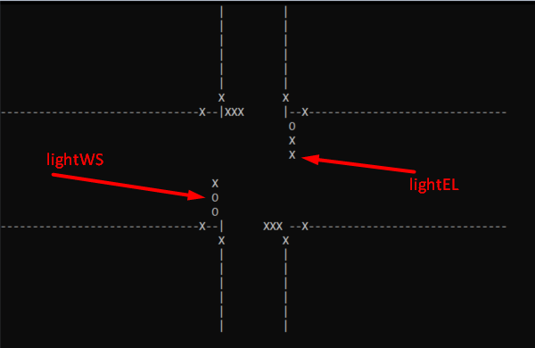

# Traffic Lights symulation

Simulation modes: 
a) randomly changing lights 
b) writing which lights to change  
 
 Pattern:  
     lightXY  
     X - {W - west, E - east, N - north, S- south}
     Y - {S - going Straight, L - left, R - right, C - crossing}

c) changing longest not changes lights 

To choose option write letter and dot in menu. For example a. or b. 

Example:  
O - green 
X - red 

